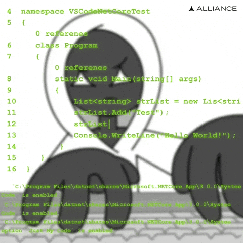
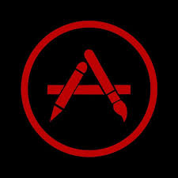

<h1 align="center">Hi 👋, I'm Muhammad Abrash</h1>
<h3 align="center">Aspiring Machine Learning Engineer • BSCS @ Institute for Arts & Culture, Lahore</h3>

  

### 👀 About Me
- 🌱 Currently learning **Advanced ML mathematics, PyTorch, Robotics algorithms, and Clean architecture**
- 💞️ Looking to collaborate on **AI/ML research projects, Open-source ML tooling**
- 📫 Reach me at **abrash.official100@gmail.com**
- ⚡ Fun fact: **I play with code the way others play video games 🎮**

### 🛠️ Languages and Tools:

<!-- Concepts: OOP, DSA -->

### 🤝 Connect with me:

### 📊 GitHub Stats:

&nbsp;

